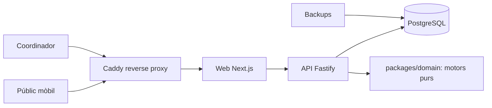
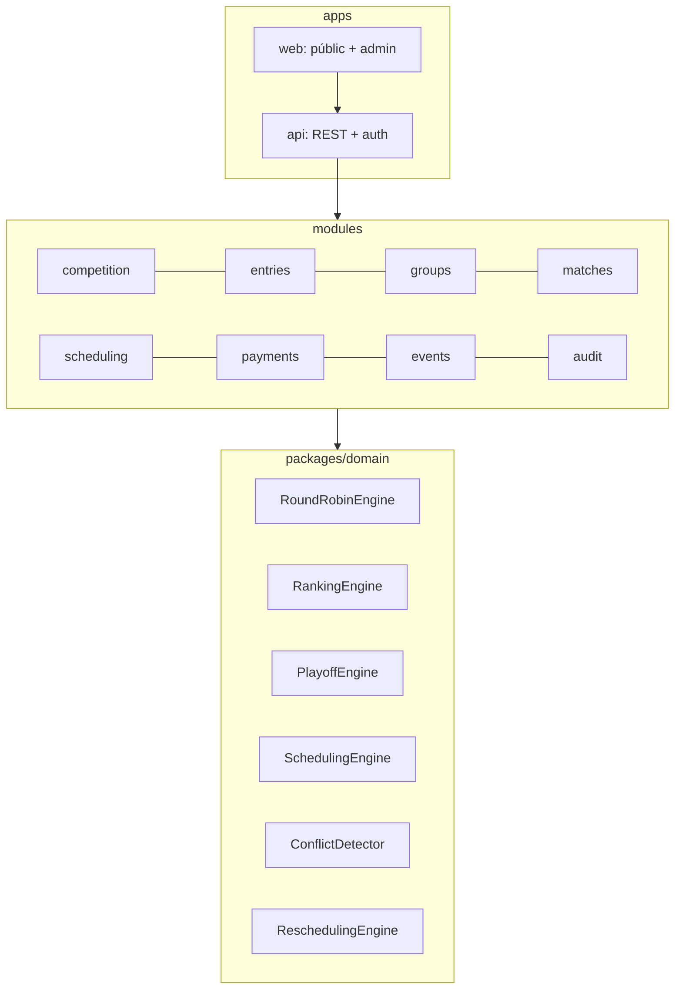
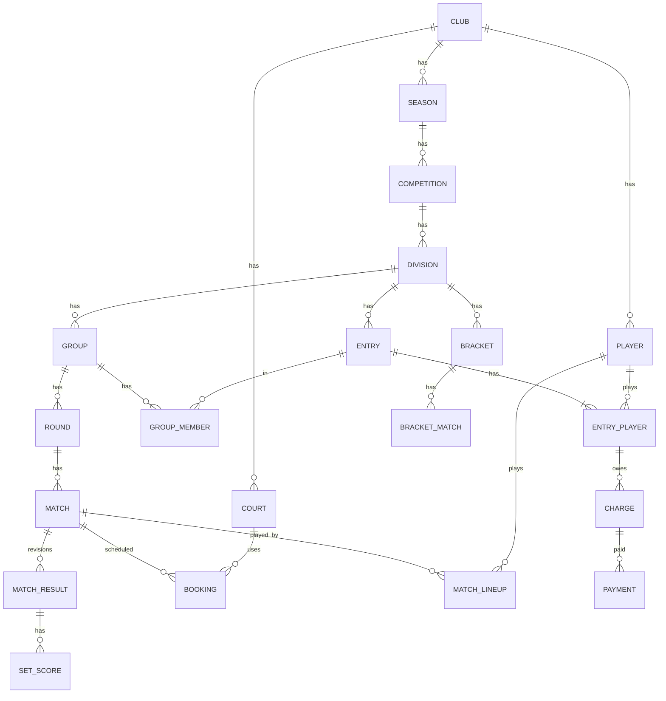
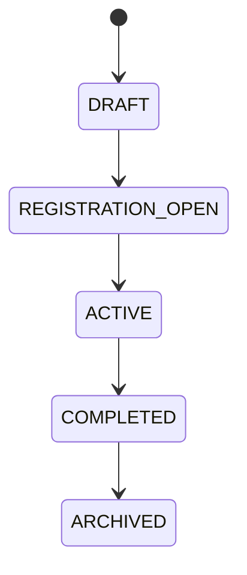
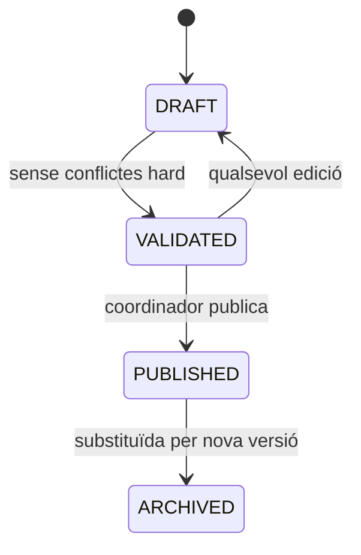
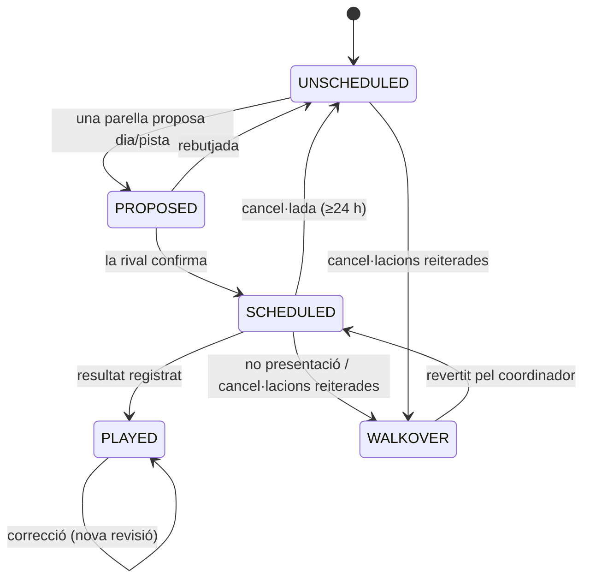

# Arquitectura — Lliga Social de Pàdel
### Club Tennis & Pàdel El Masnou · Temporada 2026/27

> Document viu d'arquitectura. Abans d'escriure codi de producció, llegeix-lo sencer.
> Estat: **decisions de domini confirmades pel coordinador (Marc)** — revisió 5.
> Implementat i testat: API + PostgreSQL (`apps/api`) i, a `packages/domain`, Round Robin, puntuació (inclòs el final per límit horari), classificació amb desempat, rànquing individual, playoffs, franges i validació de reserves, cancel·lacions/WO i cobraments de partit.

---

## 0. Resum executiu

- **Objectiu:** substituir WhatsApp + Excel + Google Sheets per una aplicació web open source que sigui la **font única de veritat** de la Lliga Social de Pàdel.
- **Primer club:** Club Tennis & Pàdel El Masnou. Arquitectura preparada per créixer (multi-prova, multi-club en el futur) sense construir ara un SaaS complet.
- **Valor principal:** automatitzar generació de competició, agenda de partits amb pistes, detecció de conflictes, WO, resultats, classificació i playoffs.
- **Arquitectura:** monòlit modular en TypeScript (Next.js + Fastify), amb un paquet de domini pur (`packages/domain`) que conté els motors, PostgreSQL com a base de dades.
- **Scheduling:** jornades **setmanals**. Les parelles **agenden elles mateixes** cada partit dins la setmana de la jornada, escollint dia i pista entre les franges de la lliga, i les dues parelles el **confirmen**. El club supervisa que tot quedi programat a temps. No hi ha ajornaments fora de la setmana.
- **Ranking:** calculat en lectura (no persistit), amb snapshot congelat en tancar cada prova. Dues vistes: classificació de parella (grup) i rànquing individual **per divisió** (categoria + nivell, mai sumat entre categories), que inclou també els playoffs.
- **Pair:** modelat com a `Entry` (inscripció a una divisió d'una competició), no com a entitat global — preserva l'històric sense necessitat de fusionar/versionar parelles.
- **WO:** no presentació a un partit confirmat → WO; cancel·lacions repetides del mateix enfrontament → WO (vegeu §2bis).
- **MVP:** accés de parella per enllaç privat (sense contrasenya) per agendar i confirmar partits; sense pagaments online, sense inventari, sense multi-club real.

---

## 1. Context del projecte

Aplicació web open source per gestionar competicions de pàdel. Primer mòdul: **Lliga Social de Pàdel**. Arquitectura preparada per incorporar en el futur lligues, tornejos, americanes, esdeveniments, rànquings, i possiblement diversos clubs — sense construir-ho ara.

## 2. Problema actual

Gestió manual (WhatsApp, Excel, Google Sheets, càlculs i assignacions manuals) → errors, duplicació, conflictes d'horari, poca traçabilitat, dependència de persones concretes.

**La base de dades de l'aplicació és la font oficial.** WhatsApp i Sheets són eines de comunicació/importació, mai la font de veritat.

**Flux central del domini:**

```
PARELLES → GRUPS → JORNADES → PARTITS → DATES → HORES → PISTES → RESULTATS → CLASSIFICACIÓ → PLAYOFFS
```

---

## 2bis. Decisions de domini confirmades (2026/27)

Aquestes decisions **resolen** algunes de les contradiccions detectades en l'anàlisi inicial i **substitueixen** els supòsits genèrics per regles concretes del club.

### Calendari de la Prova 1 (Oct–Des 2026)

- Tancament d'inscripcions: **divendres 9/10/2026**. Inici: **setmana del dilluns 12/10/2026**.
- Els **festius es juguen** (el club és obert). Només es bloquegen dies puntuals de tancament (31/12, 6/1…) → taula `blackout_date`.
- Si hi ha endarreriments, el final de la prova es pot allargar **com a màxim 1 mes**.

### Dies, franges i pistes (`CALENDAR_2026_27`)

| Categoria | Dies | Hora | Pistes |
|---|---|---|---|
| Masculina i Femenina | **dt, dc, dv** | **21:00** (marge fins a les 23:00) | **4** cada dia (opció C) |
| Mixta | **ds, dg** | torns de 90 min de **9:00** a **19:30** (últim torn): 9:00, 10:30, 12:00, 13:30, 15:00, 16:30, 18:00, 19:30 | **4**; 5a pista opcional des de les 12:00 |
| Emergència (M/F) | **dj** | 21:00 | 3 |

Les franges **extra** (dijous i 5a pista del cap de setmana) es poden reservar, però necessiten aprovació del coordinador.

- Com que les categories van en dies diferents, un jugador inscrit a Masculina/Femenina i a Mixta mai pot coincidir. El motor valida igualment **"un jugador, un partit per dia"**.
- Entre setmana només hi ha un torn per vespre, així que cada jugador juga com a màxim un partit per vespre.

### Agenda autogestionada per les parelles

- Cada jornada del Round Robin és **una setmana**. Els partits s'han de jugar dins la seva setmana; **no hi ha ajornaments** a una altra setmana.
- Una parella proposa un dia i una pista lliures dins la setmana; la parella rival **confirma** (botó "Confirmar"). Amb les dues confirmacions, el partit queda `SCHEDULED` i la pista reservada.
- El coordinador revisa cada jornada: veu quins partits encara no s'han agendat i els pot agendar ell.

### Format de partit i puntuació

- **Millor de 3 sets.** Si els dos primers sets queden 1-1, es juga un **tercer set complet**.
- Set vàlid: 6-0…6-4, 7-5, o **7-6**. A 6-6 es juga un **super tie-break a 10 punts** (2 de diferència), que es registra i compta com a set 7-6 (7 i 6 jocs).
- **Star Point** a tots els partits: després de dos iguals (40-40) seguits, el següent 40-40 es decideix amb punt d'or. Afecta el joc, no el registre del resultat.
- **Límit horari (23:00):** si el partit no ha acabat, es juga un **super tie-break a 10** que el decideix. Es registren els sets acabats, el marcador del set en joc (els seus jocs compten a la diferència de jocs, però no com a set) i el super tie-break, que compta com un set i un joc (1-0) per al guanyador.
- **Punts:** victòria **3**; derrota amb un set a favor **1** (p. ex. 6-4 / 1-6 / 7-5 → 3 per al guanyador, 1 per al perdedor); derrota **0**.

### Cancel·lacions i WO (`evaluateCancellation`)

- Cada cancel·lació amb **≥ 24 h** d'antelació és un **avís** a la parella que cancel·la (1/3, 2/3), sense cap cobrament.
- **Rebutjar la proposta d'horari de la rival compta com una cancel·lació** (avís, i WO a la 3a). Retirar la pròpia proposta no compta.
- La **3a cancel·lació** del **mateix enfrontament** per la mateixa parella → **WO** a favor de la rival, i els jugadors que han cancel·lat **paguen el partit**.
- **Cancel·lació amb < 24 h:** **no** és WO directe; compta com una cancel·lació més (avís), i només és WO si és la 3a.
- **No presentació** a un partit confirmat per les dues parelles → **WO** a favor de la parella present. Paguen el partit els jugadors absents; la parella present no paga.
- Resultat del WO: **3 punts** per a la parella perjudicada, **0** per a la que el provoca, i marcador virtual **6-0 / 6-0**.
- El coordinador rep la notificació de cada WO i el pot revertir. Tot queda a l'auditoria.

### Preus i pagament

- Pagament **per persona**, no per parella.
- **1 pagament únic per prova (trimestre):** 10 € (soci/abonat) / 20 € (no abonat).
- **Per partit jugat:** 1 € (abonat) / 5 € (no abonat).
- El pagament és **per prova**: es pot jugar 1, 2 o 3 proves sense cap restricció ni descompte obligatori entre elles.
- **No presentació:** paguen el partit els jugadors de la parella **absent** (la pista s'hauria pogut llogar). La parella present **no paga**.
- **Cancel·lacions:** els avisos no generen cobrament; a la 3a (WO), paguen el partit els jugadors que han cancel·lat.
- **Suplent:** paga els partits que juga. No paga la inscripció, excepte si vol el welcome pack.

### Suplents

- S'accepten suplents de **nivell homogeni** amb la categoria i nivell de la divisió (validació del coordinador).
- El suplent es registra a l'**alineació del partit** (`match_lineup`). El rànquing individual i els cobraments s'imputen al jugador que realment ha jugat.

### Desempat a la classificació (implementat a `computeStandings`)

1. **Punts.**
2. Empat de **2 parelles**: **enfrontament directe**. Si s'ha jugat un partit `TIEBREAK` entre elles, preval sobre el de lliga.
3. **Diferència de jocs** (tots els partits del grup; un WO compta 6-0 / 6-0).
4. **Diferència de sets.**
5. Empat de **3 o més**: **mini-lligueta** amb els partits ja jugats entre elles (punts → jocs → sets).
6. Si persisteix: **decisió del coordinador** (o partit extra `TIEBREAK`). Fins llavors, les parelles comparteixen posició i queden marcades.

Cada vegada que un criteri parteix un empat, els subgrups es tornen a resoldre des del pas 2 (p. ex. 3 empatats → la diferència de jocs en separa 1 → els 2 restants es decideixen per l'enfrontament directe).

### Round Robin (confirmat, mètode del cercle)

Amb 6 parelles, l'ordre exacte de jornades és:

| Jornada | Partit 1 | Partit 2 | Partit 3 |
|---|---|---|---|
| J1 | P1 vs P6 | P2 vs P5 | P3 vs P4 |
| J2 | P1 vs P5 | P6 vs P4 | P2 vs P3 |
| J3 | P1 vs P4 | P5 vs P3 | P6 vs P2 |
| J4 | P1 vs P3 | P4 vs P2 | P5 vs P6 |
| J5 | P1 vs P2 | P3 vs P6 | P4 vs P5 |

Aquest és el resultat estàndard del **circle method** (P1 fix, la resta roten). És un test de referència obligatori del `RoundRobinEngine` ✅.

### Rànquing individual de jugador

- És **per divisió** (categoria + nivell). **Mai se sumen** categories: un jugador a Masculina i a Mixta té dos rànquings independents.
- Compta **lliga regular + playoffs** (i partits de desempat): punts, sets i jocs guanyats/perduts.
- Ordre: punts → diferència de jocs → diferència de sets → jocs guanyats.
- És una vista calculada a partir de l'alineació real de cada partit (els suplents inclosos).

### Estructura i capacitat de la Prova 1

- 3 categories × 2 nivells (C, B) = **6 grups** de 6 parelles = **36 parelles**.
- Round Robin: 5 jornades × 3 partits × 6 grups = **90 partits**. Playoffs: 4 partits/grup = **24**. **Total: 114.**
- **Masculina + Femenina (4 grups, entre setmana):** 12 partits per jornada i **12 places** per setmana (dt/dc/dv × 4 pistes). Hi caben just, amb el dijous (3 places) com a vàlvula d'emergència.
- **Mixta (2 grups, cap de setmana):** 6 partits per jornada i 64 places regulars per cap de setmana (+12 amb la 5a pista). Molt de marge.

| Setmana | Fase |
|---|---|
| 12/10 – 18/10 | J1 |
| 19/10 – 25/10 | J2 |
| 26/10 – 01/11 | J3 |
| 02/11 – 08/11 | J4 |
| 09/11 – 15/11 | J5 |
| 16/11 – 22/11 | Semifinals + final de consolació (M/F: 12 partits, 100% de places) |
| 23/11 – 29/11 | Finals (+ desempats si cal) |

Final previst: **29/11/2026**, amb desembre i l'allargament d'1 mes com a marge.

---

## 3. Requisits funcionals

- Temporada amb 3 proves independents; categories i nivells configurables (no hardcoded).
- Importació de participants (CSV/Excel); inscripcions amb estat, preu i pagament, per jugador.
- Parelles (`Entry`) per prova; grups de mida variable; Round Robin determinista.
- Agenda autogestionada per les parelles (proposar + confirmar) dins la setmana de cada jornada; supervisió i edició pel coordinador.
- Calendari versionat.
- Resultats per sets/jocs amb validació; classificació configurable amb desempat en cascada + tiebreak real.
- Cancel·lacions amb comptador per enfrontament; WO per no presentació o cancel·lacions reiterades, revisable pel coordinador.
- Suplents per partit (alineació), amb cobrament al jugador que juga.
- Playoffs Main + Consolation configurables en nombre de classificats.
- Text compartible per WhatsApp; esdeveniments simples; auditoria de canvis clau.
- Web pública (sense login), accés de parella per enllaç privat, i panell d'administració (amb login, coordinador).

## 4. Requisits no funcionals

- **Fiabilitat:** constraints d'integritat a la BD, transaccions, motors deterministes i testats.
- **Rendiment:** scheduling en segons (volum petit: ~114 partits/prova).
- **Usabilitat:** públic mobile-first; coordinador amb flux guiat.
- **Seguretat i RGPD:** dades personals (telèfon, email) mai públiques.
- **Mantenibilitat:** motors de domini purs, sense dependència de BD ni UI.
- **Operació:** `docker compose up`, backups amb restauració provada.
- **Escalabilitat:** suficient per a un club; disseny no bloqueja creixement futur.

## 5. Actors

- **Coordinador (Marc):** administrador. Crea competicions, gestiona inscripcions i suplents, supervisa l'agenda de cada jornada, valida o reverteix WO, registra resultats i pagaments.
- **Parella (via enllaç privat):** proposa dia/pista, confirma partits, cancel·la i comunica el resultat o la no presentació del rival.
- **Visitant públic:** només lectura (calendari, classificacions, resultats, playoffs).
- **Sistema:** motors de domini, generació de calendari, detecció de conflictes.
- **Futurs actors (no MVP):** jugador amb compte i contrasenya, capità, altres clubs.

---

## 6. Domain Model

| Entitat | Necessària | Notes |
|---|---|---|
| Club | Sí | Frontera de domini (`club_id`). |
| Season | Sí | Agrupa les proves d'una temporada. |
| Competition | Sí | Cada prova (Oct-Des, Gen-Mar, Abr-Jul). Porta les regles congelades (`rules jsonb`). |
| Category / Level | Sí, catàleg per club | Masculina/Femenina/Mixta; C/B (ampliable). |
| Division | Sí | `(competition, category, level)`. |
| Player | Sí | Global dins del club. |
| **Entry** (substitueix "Pair") | Sí | Parella inscrita a una divisió d'una competició. No és una entitat global. |
| EntryPlayer | Sí | Un dels 2 jugadors d'un `Entry`; porta soci/no soci, preu snapshot, welcome pack. |
| MatchLineup | Sí | Jugadors que realment juguen un partit (titulars o suplents). |
| Group / GroupMember | Sí | Grup dins d'una divisió; membres = entries. |
| Round | Sí | Jornada lògica del round robin, amb finestra temporal. |
| Match | Sí | `entry_a_id`, `entry_b_id`, `purpose: REGULAR \| TIEBREAK \| PLAYOFF`. |
| MatchResult / SetScore | Sí | Resultat amb revisions (correccions d'històric). |
| Court | Sí | Configurable; flag de pistes assignades a la lliga. |
| Booking | Sí | Proposta de dia/pista d'una parella + confirmació de la rival; cancel·lacions amb antelació. Substitueix `Postponement`. |
| BlackoutDate | Sí | Dies de tancament del club (31/12, 6/1…). |
| Bracket / BracketMatch | Sí | Playoff Main i Consolation. |
| Event | Sí, simple | Esdeveniments de final de prova. |
| Charge / Payment | Sí, simple | Sense passarel·la; snapshot de preu. |
| WelcomePackTemplate / Delivery | Sí, sense inventari | Només seguiment d'entrega. |
| AuditLog | Sí | Append-only: qui, què, abans, després, quan. |

**Value objects:** `Score`, `TimeWindow`, `PublicName`, `Money`.

## 7. Competition Model

```
Season → Competition (prova)
           ├── Division (category + level)
           │     ├── Entry (parella inscrita)
           │     ├── Group
           │     │     ├── Round → Match
           │     └── Bracket (Main / Consolation)
           ├── Booking (reserva dia/pista per partit)
           └── rules (jsonb, congelades en activar)
```

Cada prova és un agregat autosuficient. Res es comparteix entre proves excepte `Player` i catàlegs (`Category`, `Level`, `Court`).

## 8. Player / Entry Model

```
Player (global, club_id)
   │
Entry  (parella inscrita a una divisió d'una competició)
   ├── EntryPlayer #1 → Player (+ soci/no soci, preu snapshot, welcome pack)
   └── EntryPlayer #2 → Player
```

- **Entry no és global.** Marc+Joan a la Prova 1 i Marc+Pere a la Prova 2 són dos `Entry` diferents, apuntant als mateixos `Player`. L'històric queda intacte.
- `UNIQUE (competition_id, category_id, player_id)` sobre `EntryPlayer` evita que un jugador estigui dos cops a la mateixa categoria (però sí pot jugar Masculina i Mixta alhora).
- Detecció de duplicats en importar: telèfon/email normalitzat.
- Preu, estat soci i pagament viuen a `EntryPlayer` (per jugador), no a `Entry`.
- **Suplents:** un `Player` que no és de l'`Entry` pot jugar un partit concret via `match_lineup`. El coordinador valida que sigui del mateix nivell.

---

### 8bis. Pistes compartides amb el club

No cal cap integració amb el sistema de reserves del club. N'hi ha prou que el `SchedulingEngine` conegui, com a dada de configuració de la competició, **tota la disponibilitat que el club atorga a la lliga**: els dies per categoria (dl/dt/dc/dv per a Masculina i Femenina, cap de setmana per a Mixta), la franja de les 21:00 i les 3 pistes assignades per dia (secció 2bis). Aquesta disponibilitat ja és exclusiva de la lliga dins d'aquell horari, per la qual cosa no hi ha cap conflicte a resoldre amb altres reserves de socis. `court_availability_exception` es manté només per a bloquejos puntuals (pluja, manteniment), no per a interacció amb un sistema de reserves extern.

## 9. Architecture Overview

**Modular monolith** en TypeScript, un únic desplegament.



## 10. Component Diagram



`packages/domain` no importa BD, HTTP ni frameworks: rep dades, retorna dades. Testable en aïllament.

## 11. Database Architecture

Implementat a `apps/api/migrations/001_init.sql` (PostgreSQL 16). Taules principals:

| Taula | Notes |
|---|---|
| `club`, `season`, `category` (amb `schedule`: WEEKDAY/WEEKEND), `level`, `court`, `blackout_date` | Catàlegs del club |
| `competition` | `first_week` (dilluns de la J1), `end_date`, `rules jsonb` (franges, política de cancel·lació, tarifes, mida de grup) |
| `division` | UNIQUE(competition, category, level) |
| `player` | Únic per telèfon/email normalitzat dins el club |
| `entry`, `entry_player` | `entry_player` porta `competition_id` i `category_id` desnormalitzats → UNIQUE(competition, category, player) |
| `entry_access` | Enllaç privat de parella: només es guarda el hash SHA-256 del token; revocable |
| `group`, `group_member`, `round` | `round.week_start` = setmana de la jornada |
| `match` | `status`: UNSCHEDULED → PROPOSED → SCHEDULED → RESULT_PENDING → PLAYED, o WALKOVER (`walkover_reason`) |
| `booking` | Dia/hora/pista, proposta i confirmació, aprovació (franges extra), cancel·lació |
| `cancellation` | Historial per enfrontament amb el resultat de la política (avís o WO) |
| `match_lineup` | Alineació real quan hi juga un suplent |
| `match_result` | Revisions; `sets` i `time_limit` en `jsonb`, validats pel domini; vigent = última revisió confirmada |
| `charge` | Inscripció (una per persona i prova) i partit; `paid_at`, `voided_at` |
| `audit_log` | Append-only; també serveix de bústia de notificacions de WO per al coordinador |

- Les franges són una **graella fixa** de torns de 90 min, així que un **índex únic parcial** (pista, data, hora) sobre les reserves actives garanteix que una pista no es reserva dos cops. No cal `EXCLUDE`/`btree_gist`.
- Les operacions d'agenda es serialitzen per club amb un `pg_advisory_xact_lock`, perquè la validació "un jugador, un partit per dia" no tingui curses.

## 12. ER Diagram



---

## 13. Competition Engine

Sense motor genèric universal. Primitives reutilitzables (Round, Match, Result, Standing, Rules) + mòdul específic de pàdel (puntuació per sets, validació de resultats). Quan arribin tornejos/americanes, es reutilitzen les primitives.

## 14. Round Robin Engine

- **Algorisme:** mètode del cercle (*circle method*), determinista.
- Input: llista ordenada d'entries. Output: rondes amb partits.
- Imparells: bye fictici.
- Qualsevol N ≥ 2.
- **Tests obligatoris:** 6 parelles → exactament l'ordre de la taula de la secció 2bis; 15 partits; 5 rondes; 5 partits/parella; cap repetició; cap parella contra si mateixa; N=5 i N=7 amb byes correctes.

## 15. Ranking Engine

Dues sortides, ambdues calculades (no persistides), amb cache invalidat en canviar un resultat i snapshot congelat en tancar la prova:

1. **Classificació de grup (per Entry)** — `computeStandings`: punts (3/1/0) i desempat en cascada de §2bis. Només compten els partits `REGULAR`; els `TIEBREAK` només desempaten.
2. **Rànquing individual per divisió** — `computePlayerRanking`: lliga + desempats + playoffs, a partir de l'alineació real (`match_lineup`).

## 16. Playoff Engine

- Input: standings + regles (`mainQualifiers=4`, `consolationQualifiers=2`). Output: bracket.
- Main: semis (1v4, 2v3) + final = 3 partits. Consolation: 5v6 = 1 partit. Total 4 partits/grup.
- Edició manual (seeds, participants) amb validació (cap participant repetit).

## 17. Scheduling Engine (agenda autogestionada)

Ja no és un generador de calendari central. El motor és un **validador de reserves** i un **monitor de jornada**:

- `availableSlots(week, division)`: franges lliures (dia × pista) de la setmana segons la categoria (entre setmana / cap de setmana), traient `blackout_date`, `court_availability_exception` i les reserves existents.
- `validateBooking(booking)`: comprova les hard constraints abans d'acceptar una proposta o confirmació.
- `roundStatus(week)`: partits agendats, pendents de confirmar i sense agendar, per divisió. El coordinador hi veu d'un cop d'ull què falla.

## 18. Constraint Model

- **Hard:** una pista, un partit alhora; **un jugador, un partit per dia** (inclosos suplents i jugadors en dues categories); la franja pertany als dies de la categoria; el partit cau dins la setmana de la seva jornada; pista no bloquejada; dependències de playoff (semis abans de final).
- **Soft (avisos al coordinador):** partits encara sense agendar a mitja setmana, ús desequilibrat de pistes.

## 19. Conflict Detection

`ConflictDetector`: funció pura, s'executa a cada proposta/confirmació i a la revisió de jornada. Tipus: `CourtConflict`, `PlayerConflict`, `OutsideRoundWeek`, `WrongCategoryDay`, `BlockedCourt`, `CapacityExhausted` (la setmana ja no té franges lliures per a la divisió).

## 20. Cancel·lacions i WO

Flux: `proposta (parella X) → confirmació (parella Y) → SCHEDULED → jugat | cancel·lat | no presentació`.

- **Cancel·lació ≥ 24 h:** la reserva s'allibera, la parella que cancel·la rep un avís (sense cobrament) i les parelles tornen a agendar dins la jornada. Es compta per **enfrontament i per parella que cancel·la**.
- **3a cancel·lació** → WO a favor de la rival; paguen el partit els jugadors que han cancel·lat.
- **Cancel·lació < 24 h:** igual que qualsevol altra: avís, i WO només a la 3a.
- **No presentació** a un partit confirmat → WO a favor de la parella present, i els jugadors absents paguen el partit.
- WO = `match_result` amb `outcome=WALKOVER`, dos `set_score` 6-0 / 6-0, 3 punts / 0 punts. No requereix cap tractament especial al `RankingEngine` (implementat: `walkoverSets`).
- El coordinador sempre pot revisar i revertir un WO; tot queda a `audit_log`.

## 21. State Machines







## 22. Historial de l'agenda

Ja no hi ha versions de calendari publicades: cada reserva, confirmació i cancel·lació és un registre propi (`booking`) i queda a `audit_log`. L'agenda pública sempre mostra les reserves confirmades.

## 23. API Architecture

REST amb Fastify (`apps/api`). Errors uniformes `{code, message, details}`.

| Àmbit | Autenticació | Endpoints |
|---|---|---|
| `/api/public` | cap | competicions i divisions, classificació i partits de grup, rànquing individual per divisió, agenda setmanal (només reserves confirmades, sense dades personals) |
| `/api/entry` | capçalera `X-Entry-Token` (enllaç de WhatsApp) | `me`, franges lliures, proposar, confirmar, rebutjar, cancel·lar, no presentació, resultat, confirmar/discutir resultat |
| `/api/admin` | `Authorization: Bearer ADMIN_TOKEN` (provisional) | importar parelles, generar grups i RR, playoffs, enllaç de parella + text de WhatsApp, estat setmanal, aprovar franges extra, registrar/corregir resultats amb suplents, revertir WO, cobraments i pagaments, auditoria |

**Resultats:** una parella el comunica i la rival el confirma (o el discuteix, i torna a quedar pendent). El coordinador pot registrar-lo o corregir-lo directament.

## 24-26. Frontend / Admin / Web pública

- Next.js (App Router), SSR/ISR per pàgines públiques.
- Admin: assistent guiat **Crear prova → Importar → Parelles → Grups → Round Robin → Obrir jornades**, i un tauler setmanal amb l'estat de l'agenda per divisió.
- Parella: vista mòbil "els meus partits" amb franges lliures, proposar, confirmar, cancel·lar i comunicar resultat.
- Públic: `Home → Temporada → Prova → Categoria → Nivell → Grup → Jornada → Partit`. Calendari públic com a llista per dia, amb filtres de parella/categoria/pista. Botó "Compartir per WhatsApp".

## 27. Security

Admin provisional: token de portador (`ADMIN_TOKEN`, comparació en temps constant). Amb el panell arribaran les sessions amb cookie `HttpOnly/Secure/SameSite=Lax`, Argon2, CSRF i rate limiting al login. Rols: `admin`/`coordinator`. Enllaç de parella: token aleatori (guardat com a hash), revocable i limitat a la prova; només permet actuar sobre els partits d'aquella parella. Consultes parametritzades, CSP, secrets en variables d'entorn.

## 28. GDPR

Minimització: telèfon/email/pagaments privats; nom de parella i resultats públics. Nom públic: **nom + primer cognom** ("Gemma Pou / Gemma Pascual"), decisió del coordinador.

## 29. Testing Strategy

- Unitaris ✅: RoundRobin, puntuació i validació de sets (inclòs el límit horari), classificació amb desempat, rànquing individual, playoffs, franges i validació de reserves, cancel·lacions/WO i cobraments.
- Property-based: cap entry juga contra si mateixa, cap solapament de pista/jugador, tots els partits amb participants vàlids.
- Integració: 6 entries → grup → RR → reserves setmanals → resultats → classificació amb desempat → playoffs.
- Crítics: WO per no presentació i per cancel·lacions reiterades, suplent al rànquing i als cobraments, correcció de resultat post-classificació, setmana sense franges lliures.

## 30-32. Infrastructure / Deployment / Backups

Docker Compose (`caddy`, `web`, `api`, `postgres`, `backup`). VPS petit. `pg_dump` diari + retenció + còpia offsite xifrada + prova de restauració mensual.

## 33. Open Source Strategy

MIT/Apache 2.0/AGPL-3.0 comparades. **Recomanació: AGPL-3.0**, per protegir contra un SaaS derivat tancat, tenint en compte que pot frenar alguna contribució corporativa.

## 34-37. MVP i Roadmap

**MVP1:** tot el descrit en aquest document. **MVP2:** notificacions, email, CSV millorat, estadístiques. **MVP3:** tornejos, americanes, pagaments online, comptes de jugador, WhatsApp Business, reserva de pistes. **Futur:** multi-club real, SaaS, rànquings globals, app mòbil.

## 38. Risks

| Risc | Mitigació |
|---|---|
| Entre setmana, 100% d'ocupació de pistes a cada jornada (12/12) | Dijous d'emergència amb aprovació; el tauler setmanal avisa de partits sense agendar |
| Les parelles no agenden a temps | Recordatoris i agenda forçada pel coordinador a mitja setmana |
| Regla de WO mal interpretada pels jugadors | Reglament publicat a la web + WO revisable pel coordinador |
| Dades personals filtrades | DTOs públics separats + tests de contracte |
| Sobreenginyeria | Cada abstracció justificada per un requisit actual |

---

## 39. Decisions (revisió 3)

| # | Tema | Estat |
|---|---|---|
| 1 | Festius i durada | ✅ Els festius es juguen; tancaments puntuals (31/12, 6/1) a `blackout_date`; allargament màxim d'1 mes. |
| 2 | Jugador en dues categories | ✅ M/F entre setmana, Mixta caps de setmana; el motor valida igualment un jugador, un partit per dia. |
| 3 | Desempat | ✅ Implementat (§2bis). |
| 4 | Puntuació i format | ✅ 3/1/0, millor de 3 sets, super tie-break a 10 a 6-6 i a les 23:00, Star Point. |
| 5 | Suplents | ✅ Nivell homogeni; paguen els partits jugats. |
| 6 | Ajornaments | ✅ No n'hi ha: jornades, agenda autogestionada amb confirmació. |
| 7 | Rànquing individual | ✅ Per divisió, inclou playoffs, mai sumat entre categories. |
| 8 | WO per cancel·lacions | ✅ 3a cancel·lació del mateix enfrontament; els avisos no es cobren; a la 3a paguen els que cancel·len. |
| 9 | Franges | ✅ M/F dt/dc/dv 21:00 (mín. 3 pistes); Mixta ds/dg des de les 9:00; dijous 21:00 d'emergència. |
| 10 | Accés de les parelles | ✅ Enllaç privat per parella, enviat per WhatsApp. |
| 11 | Cancel·lació amb < 24 h | ✅ No és WO directe: compta com una cancel·lació més; WO a la 3a. |
| 12 | Capacitat M/F | ✅ Opció C: 4 pistes dt/dc/dv (12 places); dijous d'emergència. |
| 13 | Franges de la Mixta | ✅ ds/dg de 9:00 a 19:30 (últim torn), 4 pistes; 5a pista opcional al migdia i a la tarda. |
| 14 | Confirmació de resultats | ✅ Una parella el comunica i la rival el confirma o el discuteix; el coordinador el pot corregir. |
| 15 | Rebuig de propostes | ✅ Rebutjar la proposta de la rival compta com a cancel·lació. |
| 16 | Accés del coordinador | ✅ Clau secreta ara; login amb usuari i contrasenya amb el panell. |
| 17 | Obertura de divisions | ✅ Només s'obren divisions amb **6 parelles o més** (grups de 6). Les altres queden inscrites i pendents; es poden obrir més tard amb la seva pròpia setmana d'inici. |
| 18 | Nom públic | ✅ Nom + primer cognom ("Gemma Pou", "Aarón de la Cruz"), per evitar ambigüitats. |
| 19 | Mixta | ✅ Nivell únic (grup de 6 amb parelles C, C+ i B). |

### Estat de les inscripcions (29/09/2026)

| Divisió | Parelles | Estat |
|---|---|---|
| Femenina C | 6 | S'obre el 12/10 |
| Mixta (nivell únic) | 6 | S'obre el 12/10 |
| Masculina C | 4 | Pendent (falten 2) |
| Masculina B | 2 | Pendent (falten 4) |
| Femenina B | 2 | Pendent (falten 4) |

---

## 40. Decisions arquitectòniques

**Arquitectura general → Monòlit modular.** Un equip petit i un sol club no justifiquen microserveis ni serverless.

**Base de dades → PostgreSQL.** Constraints d'exclusió per pistes solapades, JSONB per regles versionades, transaccions.

**Stack → TypeScript (Next.js + Fastify).** El scheduling proposat no necessita OR-Tools; un sol llenguatge de cap a cap. Accés a dades amb `pg` i SQL explícit (sense ORM): el model és petit i així es controlen bé les constraints i els bloquejos.

**REST vs GraphQL → REST.** Recursos simples, cache HTTP.

**Ranking → Calculat + cache + snapshot en tancar prova.**

**Pair model → Entry per competició, Player global.**

**Scheduling → Agenda autogestionada per les parelles amb validació de constraints al servidor. No OR-Tools/CP-SAT.**

**Autenticació → Sessions amb cookie per a l'admin; enllaç privat per parella; sense compte de jugador al MVP.**

**Multi-club → `club_id` a entitats arrel; un únic club sembrat (El Masnou).**

**Inventari → No; plantilla de Welcome Pack + estat de lliurament.**

**Pagaments → `charge` amb snapshot de preu + `payment` manual. Sense passarel·la.**

**Identificadors → UUIDv7 com a PK; slugs llegibles a les URLs públiques.**

**Regles configurables → Un sol `competition.rules jsonb`**, validat per esquema, congelat en activar la prova amb `rules_version`.

---

## Pròxims passos

1. ✅ Estructura del monorepo i `packages/domain`.
2. ✅ Motors de domini: Round Robin, puntuació, classificació amb desempat, rànquing individual, playoffs, franges i reserves, cancel·lacions/WO, cobraments.
3. ✅ Base de dades (PostgreSQL + migracions) i API pública, de parella i d'administració, amb tests d'integració del flux complet.
4. ✅ Vista de parella (web mòbil a `/p/<token>`): franges lliures, proposar, acceptar/rebutjar, cancel·lar, no presentació, resultat (amb super tie-break i límit horari) i confirmació.
5. ✅ Web pública: portada amb divisions en joc i places que falten, divisió (classificació, partits, rànquing individual) i agenda setmanal.
6. Panell del coordinador amb login.
7. Desplegament (Railway o equivalent) i còpies de seguretat.
